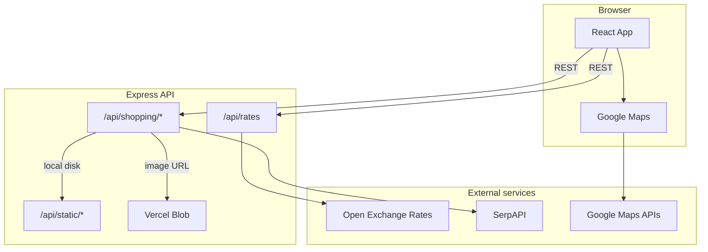

# Biyaab

Biyaab is a global product search app. Pick one or more locations on a map, search by text or image, and compare prices across regions with currency conversion to USD.

The stack is a **React** frontend (Create React App) and an **Express** API that proxies [SerpAPI](https://serpapi.com/) (Google Shopping & Google Lens) and [Open Exchange Rates](https://openexchangerates.org/).

---

## Core features

| Feature | Description |
|---|---|
| **Multi-location search** | Add several cities/countries and run one search across all of them |
| **Text search** | Google Shopping results via SerpAPI, localized per location |
| **Image search** | Upload, crop, or paste an image URL; Google Lens visual matches via SerpAPI |
| **Currency conversion** | Live exchange rates; local prices shown with USD equivalent |
| **Interactive map** | Google Maps for picking locations, geocoding, and country detection |
| **Sort & paginate** | Sort by price, rating, reviews, or source; paginate text results |

---

## Architecture



### Layers

| Layer | Path | Role |
|---|---|---|
| **Frontend** | `src/` | UI, map, search forms, result display |
| **API client** | `src/api.js` | Single `API_BASE` for all backend calls |
| **Actions** | `src/actions/shopping.js` | Search, image upload, and save-image logic |
| **Express app** | `server/app.js` | Routes, SerpAPI proxy, rates proxy, image hosting |
| **Local server** | `server/server.js` | Starts Express with `app.listen()` |
| **Vercel entry** | `api/index.js` | Exports Express app as a serverless function |

### Deployment modes

| Host | Frontend | API | Image storage |
|---|---|---|---|
| **Development** | CRA dev server `:3000` | Express `:5000` | `server/uploads/` |
| **VPS / Railway / Render** | Express serves `build/` | Same process | `server/uploads/` + `APP_URL` |
| **Vercel** | Static `build/` via CDN | `api/index.js` serverless | Vercel Blob (signed URLs for private stores) |

Production builds use `/api` as the backend URL (see `.env.production`). Development uses `REACT_APP_BACKEND_URL=http://localhost:5000/api`.

---

## Workflow

### User flow

1. **Open the app** — exchange rates load on startup.
2. **Set locations** — open the map modal, search or click to place markers, add each location to the list.
3. **Choose search mode** — text search or image search (upload, crop, or paste a URL).
4. **Search** — the app queries every selected location in parallel.
5. **Compare results** — sort by price, rating, reviews, or source; paginate text results.

### Request flow (text search)

```
User types query
  → React calls GET /api/shopping/:country/:location/:product
  → Express builds SerpAPI Google Shopping URL (with UULE for location)
  → SerpAPI returns results
  → Frontend converts prices to USD using cached rates
```

### Request flow (image search)

```
User uploads image
  → React POSTs multipart form to /api/shopping/:country/:location
  → Express uploads image to a public URL:
      • Vercel: Vercel Blob (signed URL if store is private)
      • Other hosts: disk at /api/static/:filename (requires APP_URL)
  → Express calls SerpAPI Google Lens with that image URL
  → Results returned with price/currency normalization
```

---

## Project structure

```
web/
├── api/
│   └── index.js          # Vercel serverless entry
├── server/
│   ├── app.js            # Express routes and business logic
│   ├── server.js         # Local/production server bootstrap
│   └── uploads/          # Local image storage (gitignored)
├── src/
│   ├── App.js            # Root layout, rates fetch, location modal
│   ├── api.js            # API_BASE config
│   ├── actions/
│   │   └── shopping.js   # Search API calls
│   ├── components/
│   │   ├── shopping.js   # Search UI and results
│   │   ├── setLocation.js
│   │   ├── googl_map.js
│   │   └── imageCropper.js
│   └── utils/
│       └── countryCode.js
├── vercel.json           # Vercel build and API rewrites
├── .env                  # Local secrets (not committed)
├── .env_example          # Template
└── .env.production       # Production API URL (/api)
```

---

## Prerequisites

- **Node.js** 18+
- **Yarn**
- API keys:
  - [SerpAPI](https://serpapi.com/) — `SERP_API_KEY`
  - [Open Exchange Rates](https://openexchangerates.org/) — `OPEN_EXCHANGE_APP_ID`
  - [Google Maps](https://console.cloud.google.com/) — `REACT_APP_GOOGLE_MAPS_API_KEY`, `REACT_APP_GOOGLE_MAPS_MAP_ID`

---

## Setup

```bash
yarn install
cp .env_example .env
```

Edit `.env` with your API keys:

```env
PORT=5000
SERP_API_KEY=your_key
OPEN_EXCHANGE_APP_ID=your_key
REACT_APP_BACKEND_URL=http://localhost:5000/api
REACT_APP_GOOGLE_MAPS_API_KEY=your_key
REACT_APP_GOOGLE_MAPS_MAP_ID=your_map_id
```

Restart both servers after changing `.env`.

---

## How to run

### Development (recommended)

Two terminals:

```bash
# Terminal 1 — API
yarn server

# Terminal 2 — React dev server with hot reload
yarn start
```

- Frontend: http://localhost:3000
- API: http://localhost:5000/api

For auto-restart on server changes:

```bash
yarn server:dev
```

### Production (local or VPS)

Single process serves both the React build and the API:

```bash
yarn build
yarn start:prod
```

App runs at http://localhost:5000 (or your `PORT`).

Set `APP_URL` to your public domain so image search works:

```env
APP_URL=https://your-domain.com
```

### Deploy to Vercel

1. Push the repo and import it at [vercel.com/new](https://vercel.com/new).
2. Framework preset: **Create React App**.
3. Add environment variables in the Vercel dashboard (same keys as `.env`).
4. Create a **Blob** store: Storage → Blob → Connect to Project → Redeploy.
5. Optional: set `APP_URL` to your custom domain.

`vercel.json` routes `/api/*` to the Express serverless function and serves the React build for all other paths.

**Blob access**

| Store type | Env var | Behavior |
|---|---|---|
| Private (default) | `BLOB_ACCESS=private` | Uploads are private; signed URLs are generated for SerpAPI |
| Public | `BLOB_ACCESS=public` | Direct public blob URLs |

Vercel injects `BLOB_STORE_ID` and `VERCEL_OIDC_TOKEN` when a Blob store is connected. No manual token copy is needed for production.

For local development with Blob:

```bash
vercel link
vercel env pull
```

---

## API reference

| Method | Endpoint | Description |
|---|---|---|
| `GET` | `/api/rates` | Latest exchange rates (proxied from Open Exchange Rates) |
| `GET` | `/api/shopping/:country/:location/:product` | Text search (Google Shopping via SerpAPI) |
| `POST` | `/api/shopping/:country/:location` | Image search (multipart `object` field) |
| `POST` | `/api/shopping/saveimage` | Download external image and return a hosted URL |
| `GET` | `/api/static/:filename` | Serve uploaded images (non-Vercel hosts only) |

---

## Scripts

| Command | Description |
|---|---|
| `yarn start` | React dev server |
| `yarn server` | Express API |
| `yarn server:dev` | Express API with nodemon |
| `yarn build` | Production React build → `build/` |
| `yarn start:prod` | Serve `build/` + API (non-Vercel) |
| `yarn test` | Run tests |

---

## Notes

- **Image search on localhost** does not work with Google Lens unless the image URL is publicly reachable. Use a deployed environment or set `APP_URL` to a public host.
- **Google Maps** requires billing enabled and the Maps JavaScript API, Geocoding API, and a valid Map ID for advanced markers.
- **Country codes** — some geocoding results (e.g. US territories) are normalized before SerpAPI calls (`um` → `us`).
